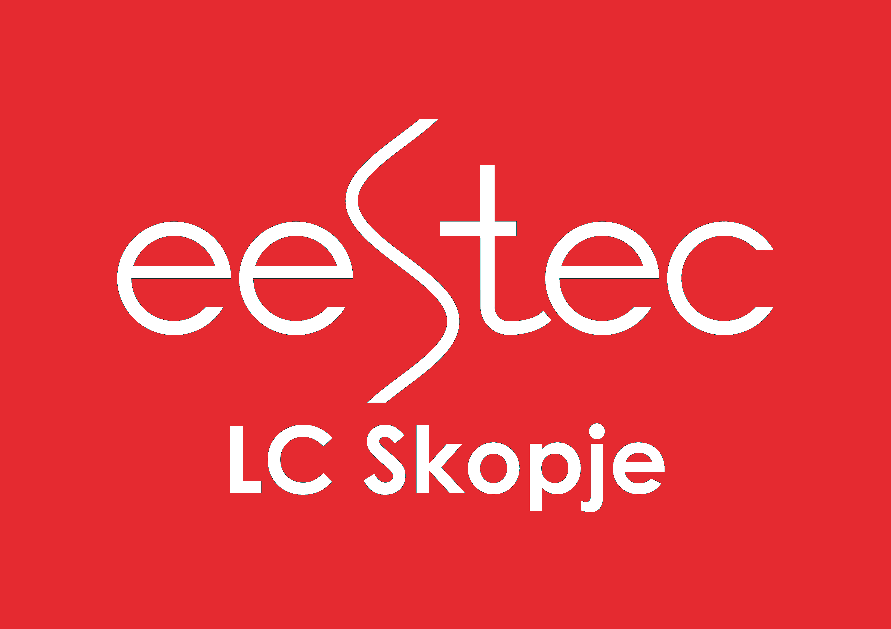

# B2B_2023
Здраво дечки, 
Во прилог имате РЕШЕНИ задачи (Лабораториски и колоквиумски задачи ЗА ПРВ И ВТОР КОЛОКВИУМ) 
во програмскиот јазик C ( МУХАХАХА ). 

Ваша задача е да ги решите задачите во програмскиот јазик C++.

(Задачите "НЕ" се баш подредени по тежина, измешани се.)

Доколку имате нешто нејасно поврзано со задачите или општо со материјалот за Структурно програмирање, 
можете да ме контактирате на:
 
Instagram: @hristovski.exe 
Viber: 071 506 808
Discord: rainbowspacefuji
email: petarhristovski23@gmail.com (Многу поретко, контактирајте ме на Инстаграм или Вибер)

Исто така можете да ме најдете на EESTEC состаноци во среда.

Ви посакувам среќна и успешна академска година,
Со почит,

Петар Христовски. 

#AjTi

27.12.2023 

